The user is asking for the full Markdown content of the "3.3 Rendering Pipeline" section from the `High-Level Architecture` wiki page. 

## 3.3 Rendering Pipeline

The rendering pipeline flows from layout calculation through buffer preparation to terminal output. 

### Pipeline Stages

```mermaid
graph LR
    subgraph "TypeScript"
        UserUpdate["User Update<br/>setState, props change"]
        RequestRender["requestRender()<br/>mark dirty"]
        FrameSchedule["Frame Scheduling<br/>throttling, debounce"]
        LayoutCalc["Layout Calculation<br/>Yoga.calculateLayout"]
        TreeTraversal["Tree Traversal<br/>render each node"]
    end
    
    subgraph "Buffer Preparation"
        ClearBuffer["Clear Buffer<br/>background fill"]
        RenderNodes["Render Nodes<br/>renderSelf callbacks"]
        PostProcess["Post-Process<br/>debug overlay, stats"]
    end
    
    subgraph "Native Zig"
        SwapBuffers["Swap Buffers<br/>next becomes current"]
        DiffCells["Diff Cells<br/>compare old vs new"]
        GenerateANSI["Generate ANSI<br/>minimal sequences"]
        WriteStdout["Write stdout<br/>terminal update"]
    end
    
    UserUpdate --> RequestRender
    RequestRender --> FrameSchedule
    FrameSchedule --> LayoutCalc
    LayoutCalc --> TreeTraversal
    TreeTraversal --> ClearBuffer
    ClearBuffer --> RenderNodes
    RenderNodes --> PostProcess
    PostProcess --> SwapBuffers
    SwapBuffers --> DiffCells
    DiffCells --> GenerateANSI
    GenerateANSI --> WriteStdout
``` 

### Stage Details

**Layout Calculation**  ([Renderable.ts:982-1012])
- Traverse Yoga layout tree 
- Update `_x`, `_y`, `_widthValue`, `_heightValue` from computed layout 
- Trigger `onLayoutResize()` callbacks on size changes 

**Tree Traversal**  ([renderer.ts:1400-1500])
- Visit nodes in z-index order 
- Call `render(buffer)` on each `Renderable` 
- Handle scissor rects for `overflow: hidden` 
- Skip invisible nodes (`visible: false`) 

**Buffer Rendering**  ([Renderable.ts:1080-1200])
- Each node calls `renderSelf(buffer)` to draw content 
- Use `OptimizedBuffer` API: `drawText()`, `setCell()`, `drawBox()` 
- Respect opacity stack and scissor rects 

**Native Diffing**  ([renderer.zig:550-700])
- Double-buffered: compare `currentRenderBuffer` vs `nextRenderBuffer` 
- Cell-level granularity: `char`, `fg`, `bg`, `attributes` 
- Track dirty regions to minimize terminal writes 
- Batch ANSI sequences for efficiency 

**Sources:**  [packages/core/src/renderer.ts:711-746], [packages/core/src/Renderable.ts:982-1012], [packages/core/src/zig/renderer.zig:550-700]

## Notes

The provided content is directly from the `High-Level Architecture` wiki page, specifically section "3.3 Rendering Pipeline".  The `Renderable.ts` file contains the `render` method, which is part of the buffer rendering stage.  The `packages/web/src/content/docs/core-concepts/renderables.mdx` file provides additional details on `Renderables` and their properties like `opacity`, `zIndex`, and `buffered` rendering, which are relevant to how rendering occurs.    The `packages/core/src/3d/canvas.ts` and `packages/core/src/renderables/__tests__/Markdown.test.ts` files were not directly relevant to the rendering pipeline as described in the wiki. 

Wiki pages you might want to explore:
- [High-Level Architecture (anomalyco/opentui)](/wiki/anomalyco/opentui#1.2)

View this search on DeepWiki: https://deepwiki.com/search/provide-the-full-markdown-cont_100f5bfb-54fe-4ff3-9ba9-3f2a5f0857a3
