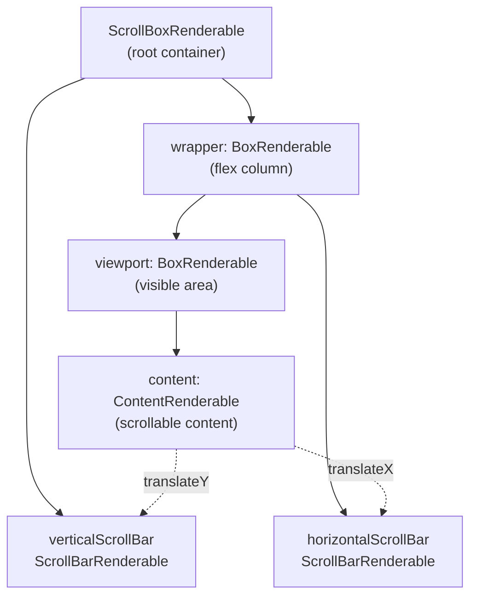

The user is asking for the Markdown content of the "ScrollBox" section, which is part of the "Layout Components" wiki page. This section describes the `ScrollBoxRenderable` component in the `@opentui/core` package.

## 4.1.2 ScrollBox

`ScrollBoxRenderable` extends `BoxRenderable` to provide scrolling functionality for content that exceeds the visible viewport. It implements a complex internal structure with multiple nested boxes for proper scroll behavior. 

### Internal Structure



**Diagram: ScrollBox Internal Component Structure** 

The `ScrollBoxRenderable` maintains a hierarchy of internal components to achieve proper scrolling behavior.  The content is translated within the viewport based on scroll position, while scrollbars provide visual feedback and interaction. 

**Sources:**  [packages/core/src/renderables/ScrollBox.ts:60-68](packages/core/src/renderables/ScrollBox.ts#L60-L68), [packages/core/src/renderables/ScrollBox.ts:261-340](packages/core/src/renderables/ScrollBox.ts#L261-L340)

### Key Features

#### Sticky Scroll

Sticky scroll automatically maintains scroll position at a specific edge (top, bottom, left, right) when new content is added, similar to terminal auto-scroll behavior.  The system tracks manual user scrolling and disables sticky behavior until the user scrolls back to the sticky edge. 

```typescript
stickyScroll: boolean          // Enable sticky scroll
stickyStart: "top" | "bottom"  // Initial sticky position
``` 

**Sources:**  [packages/core/src/renderables/ScrollBox.ts:87-200](packages/core/src/renderables/ScrollBox.ts#L87-L200), [packages/core/src/renderables/ScrollBox.ts:633-662](packages/core/src/renderables/ScrollBox.ts#L633-L662)

#### Viewport Culling

Viewport culling optimizes rendering by only processing children visible within the viewport.  This is implemented through `ContentRenderable._getVisibleChildren()`, which uses `getObjectsInViewport()` to determine visible elements. 

```typescript
viewportCulling: boolean  // Enable/disable culling (default: true)
``` 

**Sources:**  [packages/core/src/renderables/ScrollBox.ts:11-42](packages/core/src/renderables/ScrollBox.ts#L11-L42), [packages/core/src/renderables/ScrollBox.ts:34-41](packages/core/src/renderables/ScrollBox.ts#L34-L41)

#### Auto-Scroll During Drag

When dragging selections near the viewport edges, auto-scroll automatically scrolls the content at variable speeds based on proximity to the edge.  The system uses accumulators to handle sub-pixel scrolling. 

**Sources:**  [packages/core/src/renderables/ScrollBox.ts:72-83](packages/core/src/renderables/ScrollBox.ts#L72-L83), [packages/core/src/renderables/ScrollBox.ts:499-583](packages/core/src/renderables/ScrollBox.ts#L499-L583)

#### Scroll Acceleration

`ScrollBoxRenderable` supports configurable scroll acceleration algorithms through the `ScrollAcceleration` interface: 

- `LinearScrollAccel`: Constant scroll speed 
- `MacOSScrollAccel`: Accelerating scroll speed (macOS-style) 

**Sources:**  [packages/core/src/renderables/ScrollBox.ts:95](packages/core/src/renderables/ScrollBox.ts#L95), [packages/core/src/renderables/ScrollBox.ts:422-467](packages/core/src/renderables/ScrollBox.ts#L422-L467)

### ScrollBoxOptions Interface

```typescript
interface ScrollBoxOptions extends BoxOptions<ScrollBoxRenderable> {
  rootOptions?: BoxOptions           // Root container options
  wrapperOptions?: BoxOptions        // Wrapper container options
  viewportOptions?: BoxOptions       // Viewport container options
  contentOptions?: BoxOptions        // Content container options
  scrollbarOptions?: Omit<ScrollBarOptions, "orientation">
  verticalScrollbarOptions?: Omit<ScrollBarOptions, "orientation">
  horizontalScrollbarOptions?: Omit<ScrollBarOptions, "orientation">
  stickyScroll?: boolean            // Enable sticky scroll
  stickyStart?: "bottom" | "top" | "left" | "right"
  scrollX?: boolean                 // Enable horizontal scroll
  scrollY?: boolean                 // Enable vertical scroll (default: true)
  scrollAcceleration?: ScrollAcceleration
  viewportCulling?: boolean         // Enable viewport culling (default: true)
}
``` 

**Sources:**  [packages/core/src/renderables/ScrollBox.ts:44-58](packages/core/src/renderables/ScrollBox.ts#L44-L58)

### Child Management

`ScrollBoxRenderable` overrides child management methods to operate on the internal `content` component rather than the root: 

| Method | Description |
|--------|-------------|
| `add(obj, index?)` | Add child to content at optional index |
| `insertBefore(obj, anchor)` | Insert child before anchor in content |
| `remove(id)` | Remove child from content by id |
| `getChildren()` | Get children from content |

**Sources:**  [packages/core/src/renderables/ScrollBox.ts:405-419](packages/core/src/renderables/ScrollBox.ts#L405-L419)

### Scroll Control API

```typescript
scrollTop: number                    // Get/set vertical scroll position
scrollLeft: number                   // Get/set horizontal scroll position
scrollHeight: number                 // Total scrollable height
scrollWidth: number                  // Total scrollable width

scrollBy(delta, unit?)               // Scroll by delta (absolute, viewport, content, step)
scrollTo(position)                   // Scroll to absolute position
``` 

**Sources:**  [packages/core/src/renderables/ScrollBox.ts:115-160](packages/core/src/renderables/ScrollBox.ts#L115-L160), [packages/core/src/renderables/ScrollBox.ts:361-381](packages/core/src/renderables/ScrollBox.ts#L361-L381)

## Notes

The provided Markdown content for section '4.1.2 ScrollBox' is directly extracted from the "Layout Components" wiki page.  The `ScrollBoxRenderable` class is defined in `packages/core/src/renderables/ScrollBox.ts`.  The `ScrollBox` function in `packages/core/src/renderables/composition/constructs.ts` is a helper for creating `ScrollBoxRenderable` instances.  Examples of `ScrollBox` usage can be found in `packages/react/README.md`  and `packages/react/tests/layout.test.tsx`.  The `packages/core/src/tests/scrollbox.test.ts` file contains various tests for `ScrollBoxRenderable`, including sticky scroll behavior.  

Wiki pages you might want to explore:
- [Getting Started (anomalyco/opentui)](/wiki/anomalyco/opentui#2)
- [Layout Components (anomalyco/opentui)](/wiki/anomalyco/opentui#4.1)

View this search on DeepWiki: https://deepwiki.com/search/provide-the-full-markdown-cont_4fcd2c49-1800-4ef8-add0-07ff420ce9e0
