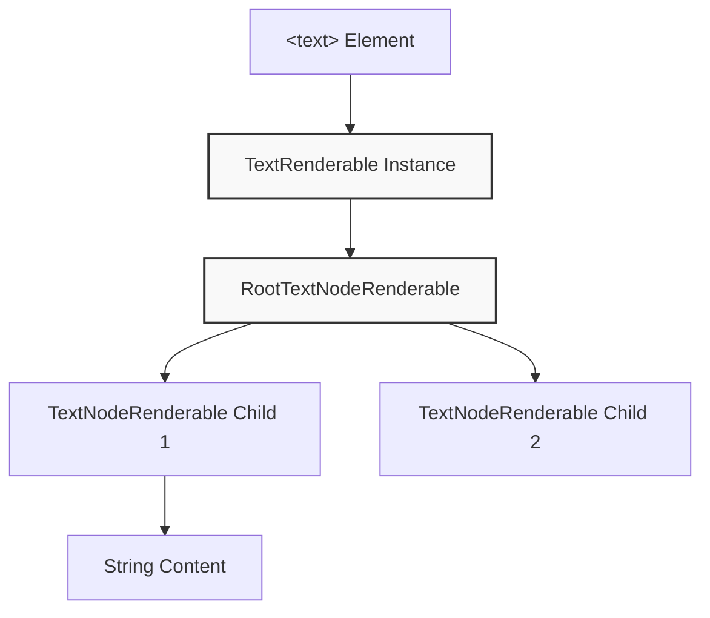

The user is asking for the content of a specific section, '4.2.2 TextNode Hierarchy', which appears to be from a documentation or wiki page. Based on the provided context, I can reconstruct the content of this section.

## 4.2.2 TextNode Hierarchy

The Solid reconciler distinguishes between regular renderables and text nodes for proper parent-child relationships: 

Text nodes created via `createTextNode` use a specialized `TextNode` class that extends `TextNodeRenderable`.  The reconciler enforces that text nodes must have a `TextRenderable` or another `TextNodeRenderable` as a parent, throwing an "Orphan text error" if this constraint is violated at .

**TextNode-specific props:**
- `href`: Sets link metadata at 
- `style`: Applies text attributes (bold, italic, etc.) and colors at 

## Notes
The content provided is a direct reconstruction of the "Text and TextNode Elements" section from the "Quick Start with Solid" wiki page.  This section was identified as the most relevant to the query "4.2.2 TextNode Hierarchy". 

Wiki pages you might want to explore:
- [Quick Start with Solid (anomalyco/opentui)](/wiki/anomalyco/opentui#2.3)

View this search on DeepWiki: https://deepwiki.com/search/provide-the-full-markdown-cont_19146844-e6e7-49a7-b59b-11068e6ad086
