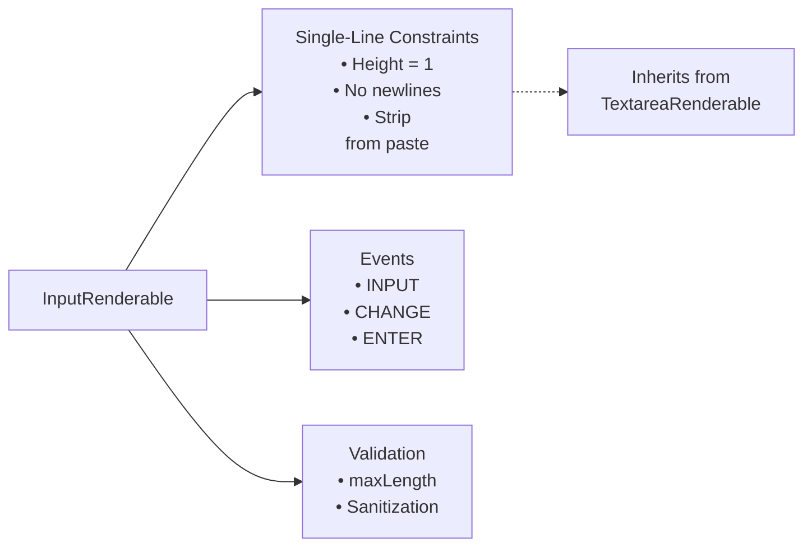
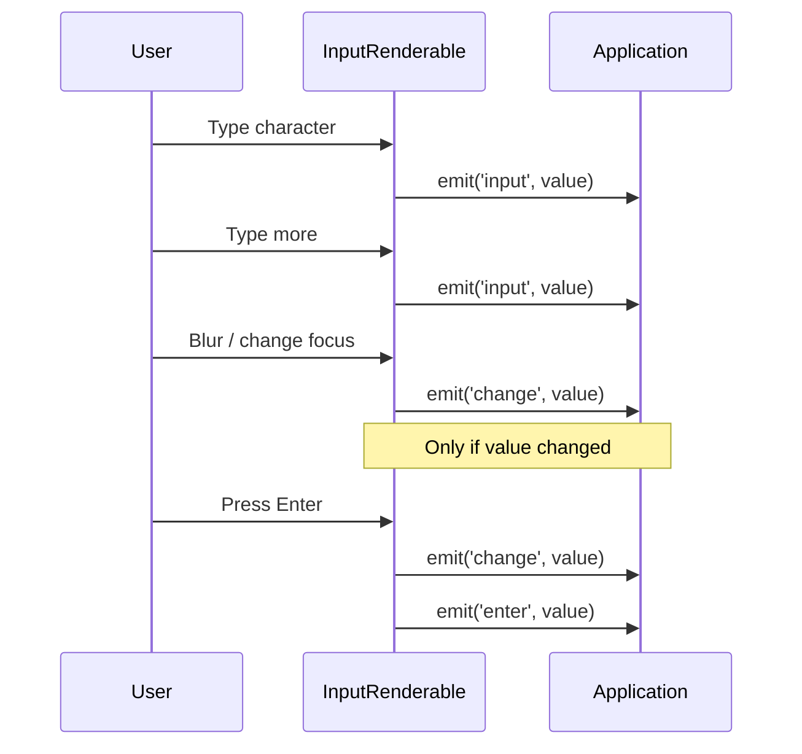

The user is asking for the full Markdown content of the "InputRenderable: Single-Line Text Input" section, which is part of the "Input Components" wiki page. This section describes the `InputRenderable` class, its purpose, key features, configuration options, event system, important methods, and usage examples.

## InputRenderable: Single-Line Text Input

### Purpose

`InputRenderable` provides a constrained single-line text input field with validation and event handling. It extends `TextareaRenderable` and overrides behavior to enforce single-line constraints. 

### Key Features

**Diagram: InputRenderable Architecture**



### Configuration Options

```typescript
interface InputRenderableOptions {
  // Inherited from TextareaRenderable
  backgroundColor?: ColorInput
  textColor?: ColorInput
  focusedBackgroundColor?: ColorInput
  focusedTextColor?: ColorInput
  placeholder?: string  // Input only supports string
  placeholderColor?: ColorInput
  keyBindings?: InputKeyBinding[]
  keyAliasMap?: KeyAliasMap
  
  // Input-specific
  value?: string        // Initial value (newlines stripped)
  maxLength?: number    // Default: 1000
}
``` 

### Event System

**Diagram: Input Event Flow**



| Event | When Emitted | Use Case |
|-------|--------------|----------|
| `INPUT` | On every keystroke | Live validation, character counting |
| `CHANGE` | On blur or enter (if changed) | Form submission, state persistence |
| `ENTER` | On Enter key press | Form submission trigger | 

### Important Methods

| Method | Description | Key Behavior |
|--------|-------------|--------------|
| `newLine()` | Override to prevent newlines | Always returns `false` |
| `handlePaste()` | Handle paste events | Strips `\n` and `\r` characters |
| `insertText()` | Insert text at cursor | Enforces `maxLength`, strips newlines |
| `set value()` | Programmatically set value | Moves cursor to end, emits INPUT |
| `get value()` | Get current text | Returns `plainText` |   

### Usage Example Pattern

From test files, typical usage pattern:

1. Create input with options (value, maxLength, placeholder)
2. Focus the input to receive keyboard events
3. Listen for INPUT events for live updates
4. Listen for CHANGE events for committed changes
5. Listen for ENTER events for form submission

## Notes

The content provided is directly from the wiki page for "Input Components" and specifically the subsection "InputRenderable: Single-Line Text Input". The `InputRenderable` class is defined in `packages/core/src/renderables/Input.ts`  and extends `TextareaRenderable` . The `InputRenderableOptions` interface defines the configurable properties for this component . The `InputRenderableEvents` enum lists the events emitted by the component .

Wiki pages you might want to explore:
- [Input Components (anomalyco/opentui)](/wiki/anomalyco/opentui#4.3)

View this search on DeepWiki: https://deepwiki.com/search/provide-the-full-markdown-cont_34fc7463-09d8-4527-9be1-25c1e5805498
