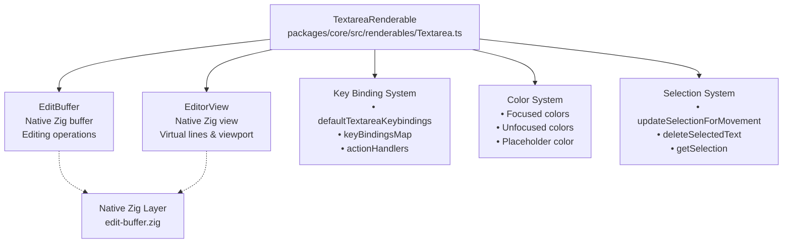
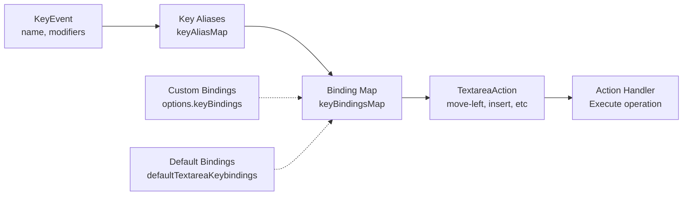

The user is asking for the full Markdown content of the section '4.3.2 Textarea' from the provided wiki page "Input Components" .

## 4.3.2 TextareaRenderable: Multi-Line Text Editor

### Purpose

`TextareaRenderable` provides a full-featured multi-line text editor with customizable key bindings, undo/redo support, cursor management, and text selection. It serves as the base for `InputRenderable` and can be used directly for multi-line editing needs. 

### Architecture

**Diagram: Textarea Component Structure**



**Sources**: [packages/core/src/renderables/Textarea.ts:142-200](), [packages/core/src/renderables/Textarea.ts:217-256]() 

### Key Binding System

`TextareaRenderable` implements a sophisticated key binding system that supports: 
- Default keybindings (Emacs-style and standard) 
- Custom keybindings via options 
- Key aliases for remapping keys 
- Modifier keys (ctrl, meta, shift, super) 
- Action handlers for all editing operations 

**Diagram: Key Binding Resolution**



**Available Actions** (`TextareaAction` type):

```typescript
type TextareaAction =
  | "move-left" | "move-right" | "move-up" | "move-down"
  | "select-left" | "select-right" | "select-up" | "select-down"
  | "line-home" | "line-end" | "visual-line-home" | "visual-line-end"
  | "buffer-home" | "buffer-end"
  | "delete-line" | "delete-to-line-end" | "delete-to-line-start"
  | "backspace" | "delete" | "newline"
  | "undo" | "redo"
  | "word-forward" | "word-backward"
  | "delete-word-forward" | "delete-word-backward"
  | "select-all" | "submit"
``` 

**Sources**: [packages/core/src/renderables/Textarea.ts:17-53](), [packages/core/src/renderables/Textarea.ts:57-125](), [packages/core/src/renderables/Textarea.ts:186-190]() 

### Default Key Bindings

The following default bindings are provided (can be overridden): 

| Keys | Action | Description |
|------|--------|-------------|
| Arrow keys | `move-left/right/up/down` | Basic cursor movement |
| Shift+Arrow | `select-left/right/up/down` | Extend selection |
| Ctrl+A / Ctrl+E | `line-home` / `line-end` | Emacs-style line navigation |
| Meta+A / Meta+E | `visual-line-home` / `visual-line-end` | Visual line boundaries |
| Cmd+Arrow (Kitty) | Buffer/visual line navigation | macOS-style navigation |
| Home / End | `buffer-home` / `buffer-end` | Jump to start/end |
| Backspace / Delete | `backspace` / `delete` | Character deletion |
| Ctrl+D / Ctrl+K | `delete` / `delete-to-line-end` | Line editing |
| Ctrl+W / Meta+D | `delete-word-backward/forward` | Word deletion |
| Ctrl+- / Ctrl+. | `undo` / `redo` | Undo/redo (also Cmd+Z) |
| Return / Linefeed | `newline` | Insert newline |
| Meta+Return | `submit` | Submit event |
| Meta+F / Meta+B | `word-forward` / `word-backward` | Word navigation | 

**Sources**: [packages/core/src/renderables/Textarea.ts:57-125]() 

### Configuration Options

```typescript
interface TextareaOptions extends EditBufferOptions {
  initialValue?: string
  backgroundColor?: ColorInput
  textColor?: ColorInput
  focusedBackgroundColor?: ColorInput
  focusedTextColor?: ColorInput
  placeholder?: StyledText | string | null
  placeholderColor?: ColorInput
  keyBindings?: KeyBinding[]
  keyAliasMap?: KeyAliasMap
  onSubmit?: (event: SubmitEvent) => void
}
``` 

**Sources**: [packages/core/src/renderables/Textarea.ts:129-140]() 

### Color Management

`TextareaRenderable` maintains separate colors for focused and unfocused states: 

- `backgroundColor` / `focusedBackgroundColor` 
- `textColor` / `focusedTextColor` 
- `placeholderColor` for placeholder text 

The `updateColors()` method switches between focused/unfocused colors automatically on focus change. 

**Sources**: [packages/core/src/renderables/Textarea.ts:177-184](), [packages/core/src/renderables/Textarea.ts:306-312](), [packages/core/src/renderables/Textarea.ts:616-626]() 

### Text Editing Operations

**Core Methods**:

| Method | Parameters | Description |
|--------|-----------|-------------|
| `insertChar(char)` | `char: string` | Insert single character at cursor |
| `insertText(text)` | `text: string` | Insert string at cursor |
| `deleteChar()` | - | Delete character at cursor |
| `deleteCharBackward()` | - | Delete character before cursor |
| `newLine()` | - | Insert newline |
| `deleteLine()` | - | Delete current line |
| `deleteToLineEnd()` | - | Delete from cursor to end of line |
| `deleteToLineStart()` | - | Delete from cursor to start of line |
| `deleteWordForward()` | - | Delete from cursor to end of word |
| `deleteWordBackward()` | - | Delete from cursor to start of word | 

**Sources**: [packages/core/src/renderables/Textarea.ts:314-330](), [packages/core/src/renderables/Textarea.ts:332-368](), [packages/core/src/renderables/Textarea.ts:523-544](), [packages/core/src/renderables/Textarea.ts:580-614]() 

### Cursor Movement

**Navigation Methods**:

| Method | Parameters | Description |
|--------|-----------|-------------|
| `moveCursorLeft(options?)` | `{ select?: boolean }` | Move left, optionally extending selection |
| `moveCursorRight(options?)` | `{ select?: boolean }` | Move right, optionally extending selection |
| `moveCursorUp(options?)` | `{ select?: boolean }` | Move up one visual line |
| `moveCursorDown(options?)` | `{ select?: boolean }` | Move down one visual line |
| `gotoLineHome(options?)` | `{ select?: boolean }` | Go to logical line start |
| `gotoLineEnd(options?)` | `{ select?: boolean }` | Go to logical line end |
| `gotoVisualLineHome(options?)` | `{ select?: boolean }` | Go to visual line start |
| `gotoVisualLineEnd(options?)` | `{ select?: boolean }` | Go to visual line end |
| `gotoBufferHome(options?)` | `{ select?: boolean }` | Go to buffer start |
| `gotoBufferEnd(options?)` | `{ select?: boolean }` | Go to buffer end |
| `gotoLine(line)` | `line: number` | Jump to specific line | 

All movement methods support the `select` option to extend the selection during movement.  The `updateSelectionForMovement()` helper manages selection state during navigation. 

**Sources**: [packages/core/src/renderables/Textarea.ts:377-434](), [packages/core/src/renderables/Textarea.ts:441-497](), [packages/core/src/renderables/Textarea.ts:499-521]() 

### Undo/Redo System

Undo/redo is implemented via the underlying `EditBuffer`: 

```typescript
undo(): boolean {
  this._ctx.clearSelection()
  this.editBuffer.undo()
  this.requestRender()
  return true
}

redo(): boolean {
  this._ctx.clearSelection()
  this.editBuffer.redo()
  this.requestRender()
  return true
}
``` 

The native Zig `EditBuffer` maintains the undo/redo stack automatically for all editing operations. 

**Sources**: [packages/core/src/renderables/Textarea.ts:546-558]() 

### Selection Management

Text selection integrates with OpenTUI's global selection system: 

- `updateSelectionForMovement(select, before)` - Called before/after movement 
- `hasSelection()` - Check if selection exists 
- `getSelection()` - Get selection range 
- `getSelectedText()` - Get selected text 
- `deleteSelectedText()` - Delete selection 
- `selectAll()` - Select all text 

Selection is automatically cleared when typing or when a non-selecting movement occurs. 

**Sources**: [packages/core/src/renderables/Textarea.ts:377-395](), [packages/core/src/renderables/Textarea.ts:356-361](), [packages/core/src/renderables/Textarea.ts:517-521]() 

### Placeholder Support

Placeholders are displayed when the buffer is empty: 

- Supports both `string` and `StyledText` placeholders 
- Custom `placeholderColor` option 
- Applied via `editorView.setPlaceholderStyledText()` 

**Sources**: [packages/core/src/renderables/Textarea.ts:199-215](), [packages/core/src/renderables/Textarea.ts:628-651]() 

### Event Handling


Wiki pages you might want to explore:
- [Input Components (anomalyco/opentui)](/wiki/anomalyco/opentui#4.3)

View this search on DeepWiki: https://deepwiki.com/search/provide-the-full-markdown-cont_bac57117-2442-4ee2-a0a6-b336928d49c4
