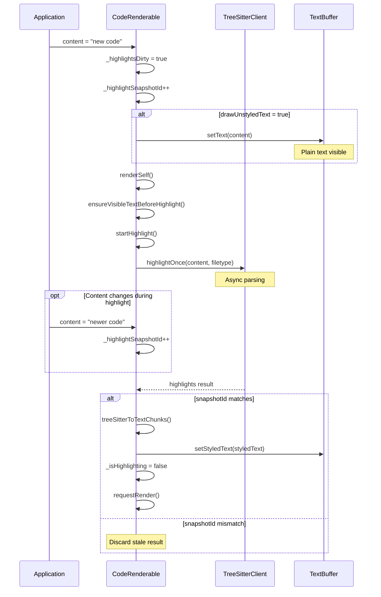

The user is asking for the Markdown content of the "CodeRenderable" section from the provided wiki page "Code Components" .

## CodeRenderable

`CodeRenderable` displays syntax-highlighted code with support for multiple languages, markdown concealment, and streaming updates. 

### Core Properties

| Property | Type | Default | Description |
|----------|------|---------|-------------|
| `content` | `string` | `""` | Source code text |
| `filetype` | `string?` | `undefined` | Language for highlighting (e.g., "typescript", "markdown") |
| `syntaxStyle` | `SyntaxStyle` | required | Token color mappings |
| `conceal` | `boolean` | `true` | Hide markup characters (markdown `**`, etc.) |
| `drawUnstyledText` | `boolean` | `true` | Show plain text before highlighting completes |
| `streaming` | `boolean` | `false` | Optimize for incremental content updates |
| `treeSitterClient` | `TreeSitterClient?` | global instance | Parser for syntax highlighting |

### Highlighting Lifecycle

The highlighting process is asynchronous and manages stale updates: 



### Content Update Handling

The component batches concurrent updates to avoid redundant highlighting: 

- **Snapshot ID**: Incremented on each content/filetype change to invalidate in-flight highlights 
- **Dirty Flag**: `_highlightsDirty` tracks whether re-highlighting is needed 
- **Stale Detection**: Completed highlights check snapshot ID before applying results 

When `content` or `filetype` changes: 
1. Increment `_highlightSnapshotId` 
2. Set `_highlightsDirty = true` 
3. If `drawUnstyledText = true`, update text buffer immediately 
4. On next render, start async highlight with current snapshot ID 
5. When highlight completes, verify snapshot ID matches before applying 

### Streaming Mode

For incremental content updates (like LLM streaming), set `streaming: true`: 

```typescript
// In streaming mode with drawUnstyledText=false:
// - Initial content update triggers highlight
// - Subsequent updates during highlighting are deferred
// - Text buffer only updates after highlight completes
```

This prevents text buffer thrashing during rapid content changes.  When `streaming = true` and `drawUnstyledText = false`, content setter skips text buffer update .

### Concealment

Markdown markup characters can be hidden when `conceal = true`: 

- Tree-sitter captures with `conceal` metadata are removed from display 
- Applied during `treeSitterToTextChunks` conversion 
- Supported captures: `**bold**`, `*italic*`, `[link](url)`, etc. 

The concealment state is part of the highlight key, so toggling it triggers re-highlighting .

## Notes

The provided content is directly from the "Code Components" wiki page, specifically the section titled "CodeRenderable" . This section describes the `CodeRenderable` class, its core properties, highlighting lifecycle, content update handling, streaming mode, and concealment features. The `MarkdownRenderable` class uses `CodeRenderable` to display code blocks within Markdown content . The `TreeSitterClient` is responsible for the asynchronous syntax parsing and highlighting .

Wiki pages you might want to explore:
- [Code Components (anomalyco/opentui)](/wiki/anomalyco/opentui#4.4)

View this search on DeepWiki: https://deepwiki.com/search/provide-the-full-markdown-cont_b08e1fd3-cb0a-4dd4-ac17-a05eaf23bfa1
