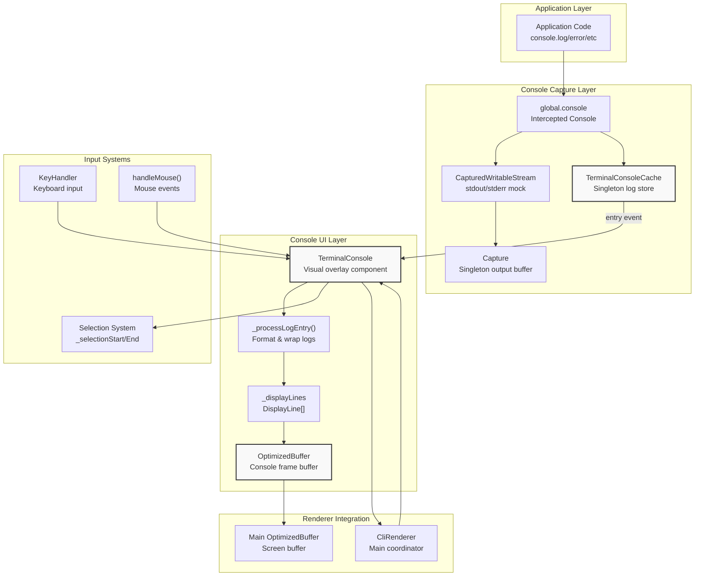
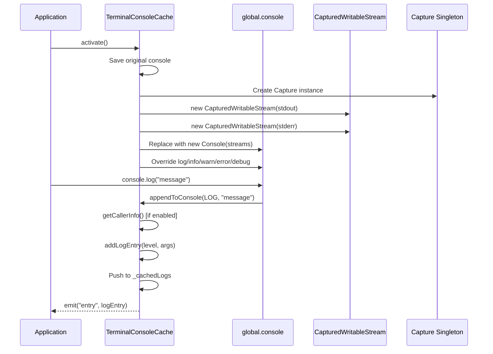
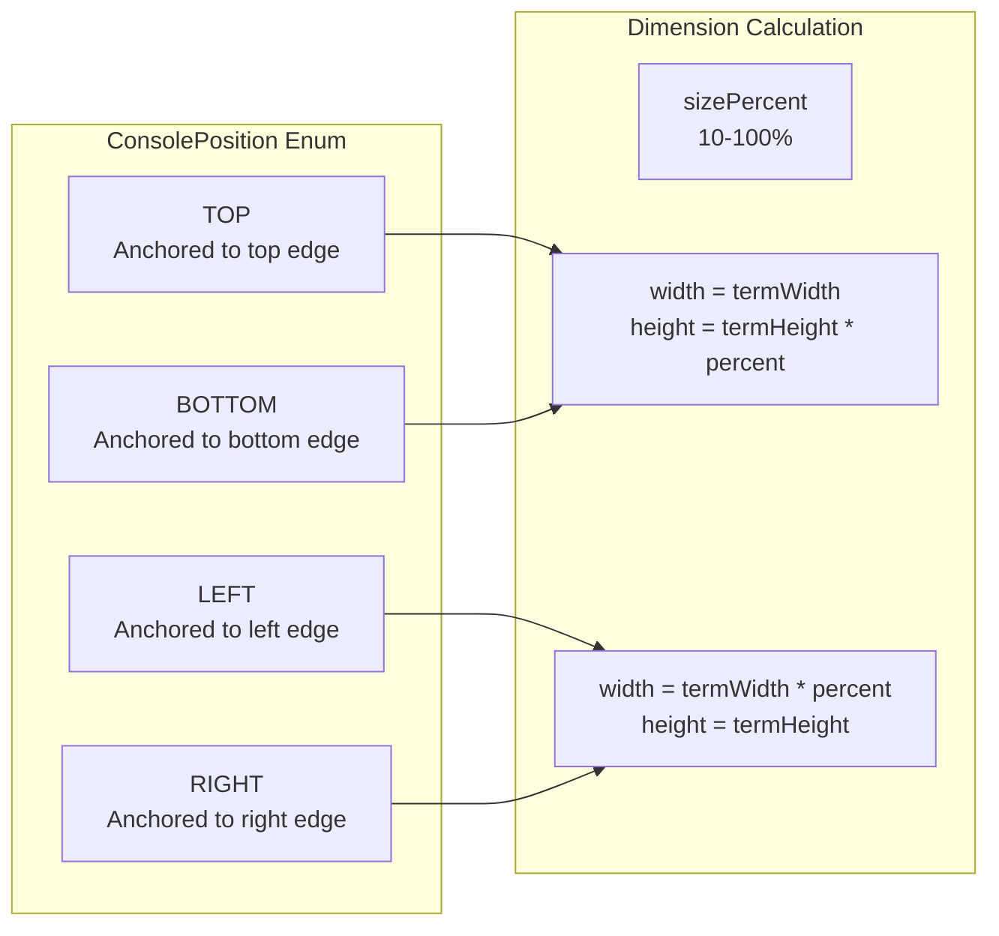
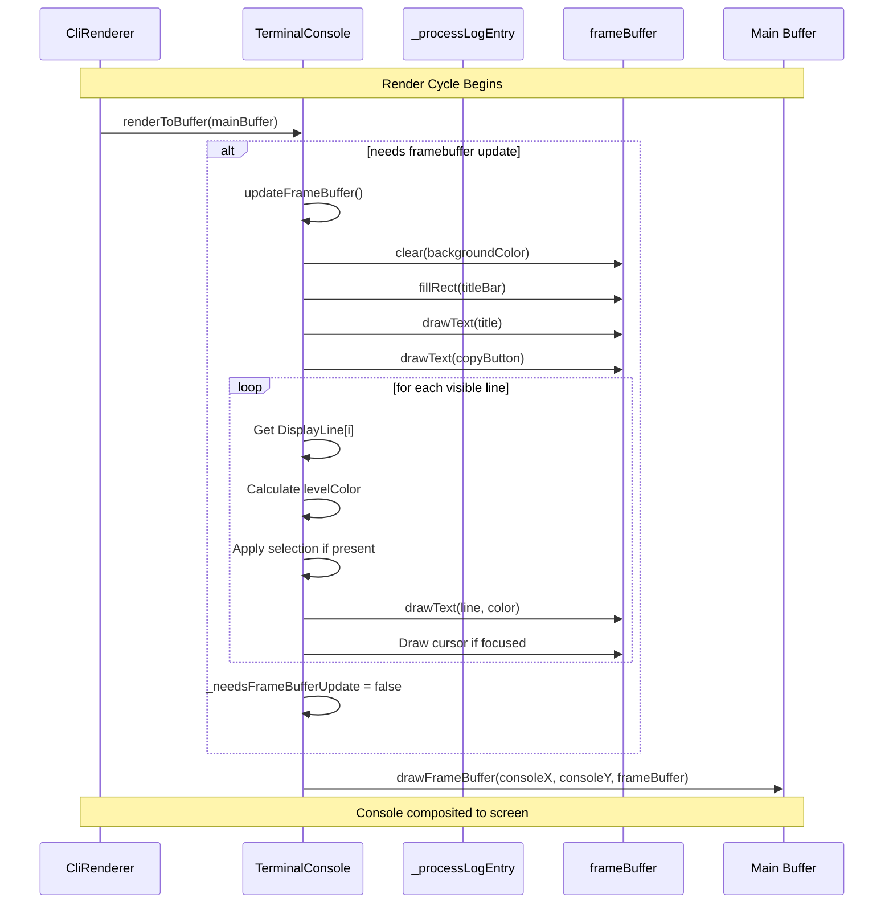
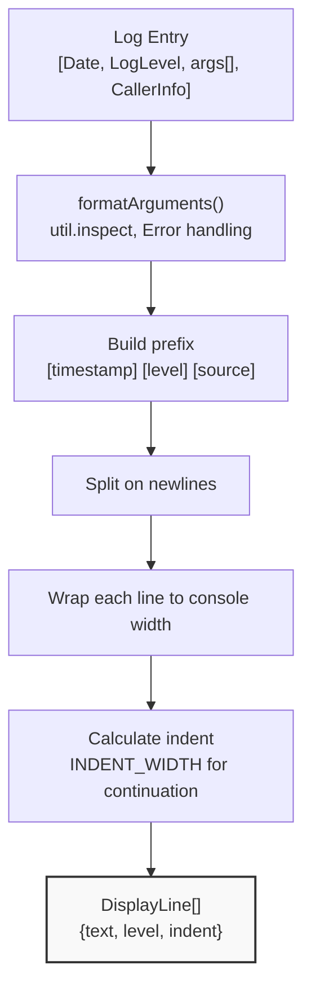
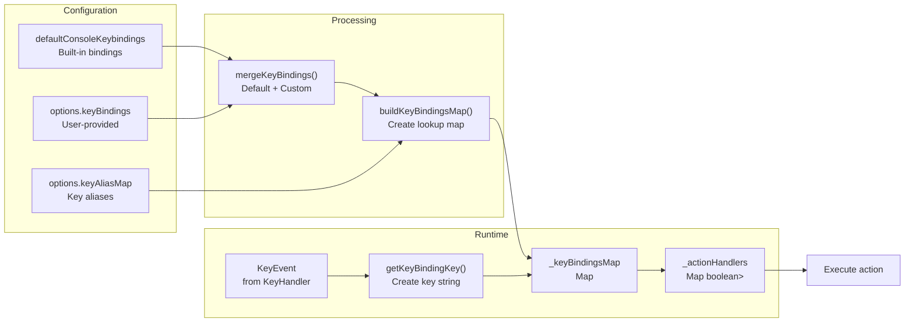

The user is asking for the full Markdown content of the "4.5 Console" section from the OpenTUI documentation. This content is available in the provided wiki page context.

```markdown
# Console

<details>
<summary>Relevant source files</summary>

The following files were used as context for generating this wiki page:

- [packages/core/src/console.test.ts](packages/core/src/console.test.ts)
- [packages/core/src/console.ts](packages/core/src/console.ts)
- [packages/core/src/lib/selection.ts](packages/core/src/lib/selection.ts)
- [packages/core/src/renderables/__tests__/Textarea.error-handling.test.ts](packages/core/src/renderables/__tests__/Textarea.error-handling.test.ts)
- [packages/core/src/types.ts](packages/core/src/types.ts)

</details>


The Console is an in-application logging and debugging overlay that captures and displays console output within OpenTUI applications. It provides a terminal UI for viewing `console.log`, `console.error`, `console.warn`, and other console methods, with support for text selection, scrolling, and configurable key bindings.

For information about input handling in general, see [Input Handling](#6). For details about rendering primitives, see [Components Reference](#4).

---

## Overview

The Console system consists of two primary classes:

- **`TerminalConsoleCache`**: A singleton that intercepts global `console` methods and accumulates log entries in memory
- **`TerminalConsole`**: A visual overlay component that renders captured logs with scrolling, selection, and interaction capabilities

The console operates as a framebuffer-based overlay that composites on top of the main application rendering. It can be positioned at any edge of the terminal (top, bottom, left, right) and sized as a percentage of the terminal dimensions.

**Sources:** 

---

## Component Architecture



**Sources:** , 

---

## Log Capture System

The console capture system intercepts the global `console` object and redirects output to an in-memory cache.

### TerminalConsoleCache

The `TerminalConsoleCache` class is a singleton that manages console interception:

| Property | Type | Description |
|----------|------|-------------|
| `_cachedLogs` | `Array<[Date, LogLevel, any[], CallerInfo \| null]>` | Circular buffer of log entries (max 1000) |
| `_collectCallerInfo` | `boolean` | Whether to capture stack trace info |
| `_cachingEnabled` | `boolean` | Whether to store logs in cache |
| `_originalConsole` | `Console \| null` | Reference to original console |

**Sources:** 

### Activation Flow



**Sources:** , 

### Log Entry Format

Each log entry is stored as a tuple:

```typescript
[Date, LogLevel, any[], CallerInfo | null]
```

Where:
- **Date**: Timestamp when log was created
- **LogLevel**: `LOG | INFO | WARN | ERROR | DEBUG`
- **any[]**: Array of arguments passed to console method
- **CallerInfo**: Optional object with `{functionName, fullPath, fileName, lineNumber, columnNumber}`

**Sources:** 

---

## TerminalConsole Class

The `TerminalConsole` class provides the visual console overlay with rendering, scrolling, and interaction capabilities.

### Core Properties

| Property | Type | Description |
|----------|------|-------------|
| `frameBuffer` | `OptimizedBuffer \| null` | Internal render buffer for console |
| `consoleX/Y` | `number` | Position of console in terminal coordinates |
| `consoleWidth/Height` | `number` | Dimensions of console overlay |
| `scrollTopIndex` | `number` | Index of first visible display line |
| `currentLineIndex` | `number` | Cursor position within visible area |
| `_displayLines` | `DisplayLine[]` | Formatted, wrapped lines ready for display |
| `_allLogEntries` | Log entry array | All stored log entries (max configurable) |
| `isVisible` | `boolean` | Whether console is shown |
| `isFocused` | `boolean` | Whether console has keyboard focus |

**Sources:** 

### Console Positions



The position determines how the console is laid out:

- **TOP/BOTTOM**: Full terminal width, height as percentage
- **LEFT/RIGHT**: Full terminal height, width as percentage

**Sources:** , 

---

## Rendering Pipeline

The console uses a double-buffered rendering approach with an internal framebuffer.

### Rendering Flow



**Sources:** 

### Display Line Processing

When logs are added to the console, they are processed into `DisplayLine` objects:



Each `DisplayLine` represents one visual line in the console:

```typescript
interface DisplayLine {
  text: string      // The text content (without prefix if indented)
  level: LogLevel   // Determines color
  indent: boolean   // Whether this is a continuation line
}
```

**Sources:** , 

### Visual Layout

```
┌──────────────────────────────────────────────────┐
│  Console (Focused)                      [Copy]   │  ← Title Bar (line 0)
│> [12:34:56] [LOG] message text here              │  ← Cursor + Log line
│  [12:34:57] [ERROR] Error: something failed      │
│    at function (file.ts:10)                      │  ← Indented continuation
│  [12:34:58] [INFO] multi-line                    │
│    object output                                 │
│    continues here                                │
│  [12:34:59] [WARN] ████████████████              │  ← Selection highlight
└──────────────────────────────────────────────────┘
```

**Sources:** 

---

## Keyboard Input Handling

The console supports configurable key bindings through the `ConsoleAction` system.

### Default Key Bindings

| Keys | Action | Description |
|------|--------|-------------|
| `↑` / `↓` | `scroll-up` / `scroll-down` | Scroll console one line |
| `Shift+↑` / `Shift+↓` | `scroll-to-top` / `scroll-to-bottom` | Jump to top/bottom |
| `Ctrl+P` / `Ctrl+O` | `position-previous` / `position-next` | Cycle console position |
| `+` / `-` | `size-increase` / `size-decrease` | Adjust console size ±5% |
| `Ctrl+S` | `save-logs` | Save logs to file |
| `Ctrl+Shift+C` | `copy-selection` | Copy selected text |
| `Esc` | — | Blur console (built-in) |

**Sources:** 

### Key Binding System



**Sources:** , , 

### Action Handlers

Each action is mapped to a handler function:

```typescript
buildActionHandlers(): Map<ConsoleAction, () => boolean> {
  return new Map([
    ["scroll-up", () => this.scrollUp()],
    ["scroll-down", () => this.scrollDown()],
    ["scroll-to-top", () => this.scrollToTop()],
    ["scroll-to-bottom", () => this.scrollToBottomAction()],
    ["position-previous", () => this.positionPrevious()],
    ["position-next", () => this.positionNext()],
    ["size-increase", () => this.sizeIncrease()],
    ["size-decrease", () => this.sizeDecrease()],
    ["save-logs", () => this.saveLogsAction()],
    ["copy-selection", () => this.triggerCopyAction()],
  ])
}
```

**Sources:** 

---

## Mouse Input Handling

The console supports mouse interaction for text selection, scrolling, and copy button clicks.

### Mouse Event Processing

```mermaid
stateDiagram-v2
    [*] --> Idle
    
    Idle --> CheckBounds: handleMouse(event)
    CheckBounds --> OutOfBounds: x,y outside console
    

Wiki pages you might want to explore:
- [Console (anomalyco/opentui)](/wiki/anomalyco/opentui#4.5)

View this search on DeepWiki: https://deepwiki.com/search/provide-the-full-markdown-cont_baf2d471-69f2-4714-ae76-188054403e62
