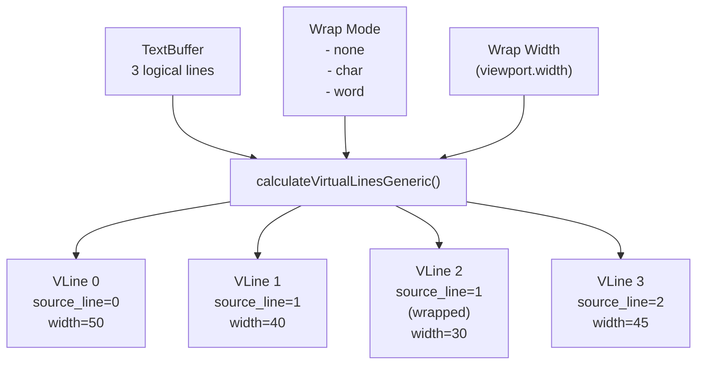
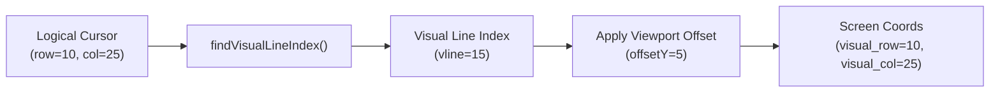

The user is asking for the Markdown content of section '5.3 TextBufferView and EditorView' from the provided wiki page "Text Buffer System" .

## 5.3 TextBufferView and EditorView

### TextBufferView

`TextBufferView` manages viewport state and generates virtual lines for rendering. It does **not** own the text buffer but maintains a view into it. 

**Key Responsibilities:** 

1.  **Viewport Management**: Track visible region (x, y, width, height) 
2.  **Text Wrapping**: Generate virtual lines based on wrap mode 
3.  **Selection Tracking**: Convert between local and global coordinates 
4.  **Caching**: Maintain virtual line cache with dirty tracking 

**Virtual Line Generation:** 



**Virtual Line Structure:** 

```
VirtualLine {
  chunks: []VirtualChunk     // References to TextChunks
  width: u32                 // Display width
  char_offset: u32           // Grapheme offset from line start
  source_line: usize         // Original logical line number
  source_col_offset: u32     // Column offset in source line
  is_truncated: bool         // Truncation flag
  ellipsis_pos: u32          // Position of "..." if truncated
}
``` 

Sources:  

### EditorView

`EditorView` extends `TextBufferView` functionality with cursor management and scroll coordination. 

**Additional Responsibilities:** 

1.  **Cursor Visibility**: Ensure cursor stays within viewport during edits 
2.  **Scroll Margin**: Keep cursor away from viewport edges (configurable as % of height) 
3.  **Visual Cursor Calculation**: Convert logical cursor to viewport-relative coordinates 
4.  **Selection Follow**: Optionally scroll viewport during text selection 

**Cursor Coordinate Conversion:** 



**Scroll Margin Behavior:** 

```
Viewport height: 24 lines
Scroll margin: 0.2 (20%)
Margin size: 4 lines

Cursor triggers scroll when:
- visual_row < 4 (too close to top)
- visual_row > 19 (too close to bottom)
``` 

Sources:  

## Notes

The provided content is directly extracted from the "Text Buffer System" wiki page . The `TextBufferView` and `EditorView` are core components of the view layer in the OpenTUI text buffer system . `TextBufferView` handles the display of text, including wrapping and viewport management , while `EditorView` builds upon this by adding cursor and scroll management features, ensuring the cursor remains visible within the viewport . Both components expose methods for setting and getting viewport properties, wrap modes, and selection information  .

Wiki pages you might want to explore:
- [Text Buffer System (anomalyco/opentui)](/wiki/anomalyco/opentui#5)

View this search on DeepWiki: https://deepwiki.com/search/provide-the-full-markdown-cont_9725b690-c336-4bb0-af13-fe57b387c748
