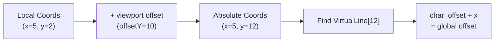

The user is asking for the full Markdown content of section '5.5 Text Selection' from the `Text Buffer System` wiki page. This section describes how text selection is handled in OpenTUI, differentiating between global offset-based and local coordinate-based selection, and explaining the coordinate to offset conversion and snapping behavior.

## 5.5 Text Selection

Selection operates in two modes: **global offset-based** and **local coordinate-based**.

**Global Selection (offset-based):** 

```
TextSelection {
  start: u32      // Grapheme offset from buffer start
  end: u32        // Grapheme offset from buffer start
  bgColor: ?RGBA
  fgColor: ?RGBA
}
``` 

Used by: `TextRenderable`, `TextBufferRenderable`

**Local Selection (coordinate-based):** 

```
LocalSelection {
  anchorX: i32   // Viewport-relative column
  anchorY: i32   // Viewport-relative row
  focusX: i32    // Viewport-relative column
  focusY: i32    // Viewport-relative row
  isActive: bool
}
``` 

Used by: `EditBufferRenderable`, `TextareaRenderable` (with viewport scrolling)

**Coordinate to Offset Conversion:** 



**Snapping Behavior:** 

When converting coordinates to offsets, OpenTUI snaps to grapheme boundaries:

```
include_start_before = true (for selection end):
  - Include grapheme if it STARTS before max_columns
  - Snaps forward to include whole grapheme

include_start_before = false (for selection start):
  - Include grapheme only if it ENDS before max_columns
  - Snaps backward to exclude wide graphemes
``` 

## Notes

The provided content is directly from the 'Text Buffer System' wiki page, section '5.5 Text Selection'. This section details the two primary modes of text selection within OpenTUI: global offset-based selection, which uses grapheme offsets from the buffer's start, and local coordinate-based selection, which uses viewport-relative coordinates. It also explains the conversion process between these coordinate systems and the snapping behavior to grapheme boundaries during selection. The `TextRenderable` and `TextareaRenderable` components are examples of where these selection mechanisms are utilized. Test files like `packages/core/src/renderables/__tests__/Textarea.selection.test.ts`  and `packages/core/src/renderables/Text.test.ts`  demonstrate various selection scenarios, including handling multi-line text, empty lines, graphemes, and cross-renderable selections. The `packages/core/src/text-buffer-view.test.ts`  file further illustrates how selection state is tracked and updated.

Wiki pages you might want to explore:
- [Text Buffer System (anomalyco/opentui)](/wiki/anomalyco/opentui#5)

View this search on DeepWiki: https://deepwiki.com/search/provide-the-full-markdown-cont_8ad526ba-f06d-450a-b991-144a3e06b079
