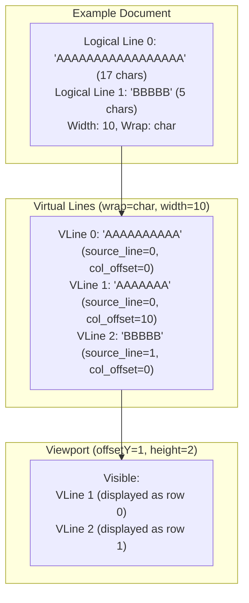

The user is asking for the Markdown content of the "5.7 Coordinate Systems" section from the provided wiki page. This section describes the different coordinate systems used within OpenTUI and their transformations.

## 5.7 Coordinate Systems

OpenTUI uses five distinct coordinate systems for different purposes: 

**Coordinate System Overview:** 

| System | Origin | Unit | Wrapping | Use Case |
|--------|--------|------|----------|----------|
| **Screen** | Top-left of terminal | Cells | N/A | Mouse events, hit testing |
| **Local** | Top-left of component | Cells | N/A | Component-relative rendering |
| **Viewport** | Top-left of visible area | Cells | Respects | Visible text region |
| **Logical** | Top-left of document | Lines × Cols | Ignores | Cursor position, editing |
| **Visual** | Top-left of virtual lines | Virtual Lines × Cols | Respects | Rendering, display | 

**Transformation Examples:** 



**Coordinate Conversion Functions:** 

```
coordsToOffset(x: i32, y: i32) -> ?u32
  1. Add viewport offset: abs_y = y + viewport.y
  2. Get VirtualLine[abs_y]
  3. Return vline.char_offset + x

offsetToCoords(offset: u32) -> ?(x: i32, y: i32)
  1. Find VirtualLine containing offset
  2. x = offset - vline.char_offset
  3. y = vline_index - viewport.y
  
logicalToVisual(logical_row: u32, logical_col: u32) -> (visual_row: u32, visual_col: u32)
  1. Find first VLine with source_line == logical_row
  2. Search VLines for col within range
  3. Return (vline_index, col - vline.source_col_offset)
``` 

## Notes
The provided content is directly extracted from the "Text Buffer System" wiki page . The `edit-buffer.test.ts` file contains tests for coordinate conversion functions like `offsetToPosition` and `positionToOffset` , which are related to the "Logical" coordinate system described in the wiki.

Wiki pages you might want to explore:
- [Text Buffer System (anomalyco/opentui)](/wiki/anomalyco/opentui#5)

View this search on DeepWiki: https://deepwiki.com/search/provide-the-full-markdown-cont_6a5f171b-c59c-4127-830d-66c7fbd91fc5
